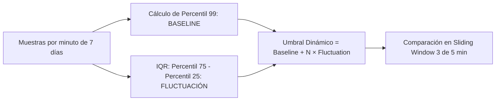

# Alertas y Umbrales Auto-Adaptativos (Auto-Adaptive Thresholds) en Dynatrace

Esta skill detalla los principios matemáticos, arquitectónicos y de configuración del motor de **umbrales auto-adaptativos (*Auto-Adaptive Thresholds*)** y el **baselining multidimensional automatizado** de Dynatrace Davis AI.

---

## 1. Arquitectura Matemática del Umbral Auto-Adaptativo

A diferencia de los umbrales estáticos rígidos, los umbrales auto-adaptativos recalculan diariamente la línea base de referencia a partir del comportamiento histórico de los últimos **7 días** de mediciones ([Auto-adaptive thresholds](https://docs.dynatrace.com/docs/dynatrace-intelligence/anomaly-detection/auto-adaptive-threshold)).



### Componentes del Modelo Matemático:
1. **Línea Base (*Baseline*):**
   - Se procesan las mediciones minuto a minuto de los 7 días previos.
   - El valor de referencia base corresponde al **Percentil 99 (P99)** de dichas observaciones.
2. **Fluctuación de la Señal (*Signal Fluctuation*):**
   - Se calcula el **Rango Intercuartil (IQR)** entre el percentil 25 y el percentil 75:
     $$\text{Fluctuación} = P_{75} - P_{25}$$
3. **Umbral Adaptado Final:**
   $$\text{Threshold} = \text{Baseline} + (k \times \text{Fluctuación})$$
   Donde $k$ (*number of signal fluctuations*) es un factor multiplicador configurable según la volatilidad natural de la métrica.

---

## 2. El Cubo de Baselining Multidimensional (Multi-Dimensional Baselining Cube)

Dynatrace no calcula un único promedio global para una aplicación o servicio; descompone la telemetría en un **cubo multidimensional** para aislar patrones específicos y evitar falsas alarmas provocadas por mezclas heterogéneas de tráfico ([Automated multi-dimensional baselining](https://docs.dynatrace.com/docs/dynatrace-intelligence/anomaly-detection/automated-multidimensional-baselining)).

| Nivel de Observabilidad | Dimensiones del Cubo de Baseline | Propósito |
|---|---|---|
| **Aplicaciones Web / RUM** (4 Dimensiones) | 1. **User Action** (ej. `login`, `checkout`, `load`)<br>2. **Geolocation** (Continente, País, Región, Ciudad)<br>3. **Browser Family / OS** (Chrome, Firefox, Safari)<br>4. **Connection Type / Bandwidth** | Una acción pesada en una red móvil lenta o una ciudad distante no degrada la línea base de usuarios corporativos en LAN. |
| **Servicios Backend / APIs** (2 Dimensiones) | 1. **Service Method / Web Request Endpoint**<br>2. **Technical Context / Caller** | Un endpoint de reporte pesado en batch no altera la línea base de un microservicio transaccional ligero. |

---

## 3. Ciclos de Aprendizaje y Períodos de Referencia

Davis AI aplica reglas temporales estrictas antes de abrir alertas automatizadas ([Automated multi-dimensional baselining](https://docs.dynatrace.com/docs/dynatrace-intelligence/anomaly-detection/automated-multidimensional-baselining)):

1. **Período de Inicialización (Nuevos Servicios < 24 Horas):**
   - Durante las primeras 24 horas tras el despliegue de un nuevo servicio o aplicación, Davis calcula líneas base intermedias en intervalos cortos y adaptados para habilitar monitoreo temprano.
2. **Requisito Mínimo de Aprendizaje (20% de una Semana):**
   - La detección de degradación de tiempo de respuesta (*Response Time*) y aumento en tasa de fallas (*Failure Rate*) requiere que la entidad o endpoint haya registrado actividad durante al menos el **20% de 7 días (~33.6 horas)**.
3. **Detección de Patrones de Tráfico (Spikes / Drops):**
   - Requiere un período completo de **7 días** de datos continuos para modelar con precisión los ciclos día/noche y días laborales vs fines de semana. Finalizado el período, Davis genera un pronóstico (*forecast*) para la semana siguiente y alerta ante desvíos estadísticamente significativos.

---

## 4. Mecánica de Ventanas Deslizantes (Sliding Window) y Delays

Para evitar alertas prematuras causadas por un pico aislado de 60 segundos, los detectores evalúan las violaciones mediante una ventana móvil ([Auto-adaptive thresholds](https://docs.dynatrace.com/docs/dynatrace-intelligence/anomaly-detection/auto-adaptive-threshold), [Anomaly detection configuration](https://docs.dynatrace.com/docs/dynatrace-intelligence/anomaly-detection/anomaly-detection-configuration)):

| Parámetro | Configuración por Defecto | Recomendación de Calibración |
|---|---|---|
| **Sliding Window** | `3 minutos violados dentro de 5 minutos` | Para sistemas críticos con alta volatilidad o ráfagas (bursts), aumentar a `5/10 min` o `4/8 min` para evitar aperturas efímeras de problemas. |
| **Query Delay** | `1 Minute` | En custom alerts DQL, configurar a `5 Minutos` reduce el costo de procesamiento de queries en Grail manteniendo evaluación retroactiva minuto a minuto. Máximo permitido: `60 Minutos`. |
| **Query Offset** | `0 Minutes` | Si la ingesta de telemetría presenta latencia natural de red o cola, configurar el offset en minutos para evitar falsos positivos por falta temporal de mediciones. |

---

## 5. Calibración de Sensibilidad por Tipo de Telemetría

En la configuración de detección de anomalías ([Adjust sensitivity for services](https://docs.dynatrace.com/docs/dynatrace-intelligence/anomaly-detection/adjust-sensitivity-anomaly-detection/adjust-sensitivity-services), [Adjust sensitivity for applications](https://docs.dynatrace.com/docs/dynatrace-intelligence/anomaly-detection/adjust-sensitivity-anomaly-detection/adjust-sensitivity-applications)):

### 5.1. Degradación de Tiempo de Respuesta
- **Evaluación combinada de percentiles:**
  - **Mediana (P50):** Detecta ralentización general que afecta a la mayoría de los usuarios.
  - **Percentil 90 (P90 - 10% más lento):** Captura problemas graves que impactan a un subconjunto de usuarios o transacciones pesadas.
  - El problema se dispara si la mediana **O** el percentil 90 superan simultáneamente el umbral absoluto y relativo calculado.
- **Nivel de Confianza Estadística (*Statistical Confidence*):**
  - **Low:** Exige alta confianza estadística; tolera ráfagas de carga sin alertar.
  - **Medium (Recomendado):** Equilibrio óptimo para producción.
  - **High:** Sin margen de tolerancia; alerta ante cualquier transgresión.

### 5.2. Aumento en Tasa de Fallas (*Failure Rate*)
- Exige violación doble: incremento **relativo (%)** sobre la tasa habitual Y superación de un piso **absoluto (%)**.
- **Parámetro de permanencia anómala (*Abnormal duration*):** Exigir al menos `3 a 5 minutos` en fallo antes de alertar.

### 5.3. Exclusión por Baja Carga (*Low-Load / Low-Traffic Exclusion*)
> [!IMPORTANT]
> Configurar siempre un límite de `actions/min` o `requests/min`. Si la tasa cae por debajo de ese límite, el servicio queda temporalmente excluido del baselining de tiempo de respuesta para evitar falsas alarmas provocadas por una única solicitud lenta en horas valle.

---

## 6. Modelos de Análisis en Custom Alerts (Grail & Anomaly Detection App)

Al crear detectores personalizados en la **Anomaly Detection App** sobre datos de Grail ([Anomaly detection configuration](https://docs.dynatrace.com/docs/dynatrace-intelligence/anomaly-detection/anomaly-detection-configuration), [Anomaly Detection app](https://docs.dynatrace.com/docs/dynatrace-intelligence/anomaly-detection/anomaly-detection-app)):

```dql
// Ejemplo de consulta DQL válida para Timeseries Analyzer
timeseries avg_resp = avg(dt.service.response_time),
  by: { dt.entity.service },
  interval: 1m
```

### Tipos de Analizadores Disponibles:
1. **Auto-Adaptive Threshold Analyzer:**
   - Divide la serie en baseline + fluctuación de señal. Ideal para métricas continuas sin patrón estacional estricto pero con variaciones de tendencia.
2. **Seasonal Baseline Analyzer:**
   - Genera una banda de confianza adaptativa según el ciclo horario y semanal.
   - Parámetro **Tolerance**: Define el ancho de la banda de confianza; mayor tolerancia reduce alertas ante variaciones atípicas.
3. **Static Threshold Analyzer:**
   - Compara contra un valor fijo estático. Cuenta con la opción *Suggest values* que calcula automáticamente el umbral recomendado en base a los datos históricos previos.

### Reglas de Seguridad en la Ejecución:
- **Límite de Timeout DQL:** 10 segundos (`10000 ms`).
- **Throttling Progresivo:** Si la query de alerta falla repetidamente, Dynatrace escala el intervalo de reintento (`2m ➔ 4m ➔ 8m ➔ 16m ➔ 32m ➔ 64m ➔ 24h`) para proteger recursos y controlar costos.
- **Actor:** Asignar siempre un `Service User` institucional para evitar dependencia de credenciales personales.

---

## 7. Matriz de Decisión: ¿Cuándo Usar Cada Modelo?

| Escenario Operativo | Modelo Recomendado | Justificación Técnica |
|---|---|---|
| Tiempo de respuesta de endpoints HTTP / gRPC | **Auto-Adaptive (Davis AI)** | Absorbe variaciones naturales de demanda y percentil 90. |
| Caídas / Picos de tráfico en sitio web | **Seasonal Baseline / 7-Day Forecast** | Aprende la estacionalidad laboral y de fines de semana. |
| Disponibilidad de discos y sistemas de archivos | **Static / Disk Edge Alerting** | El límite de capacidad física no depende de la hora ni del día. |
| Microservicios con tráfico intermitente (< 5 req/min) | **Static con Low-Load Filter** | El baselining estadístico requiere volumen continuo representativo. |
| Detección de fallas en lotes batch programados | **Records / Anomaly Detector con Offset** | Los procesos batch tienen ejecuciones puntuales que no forman series continuas. |
