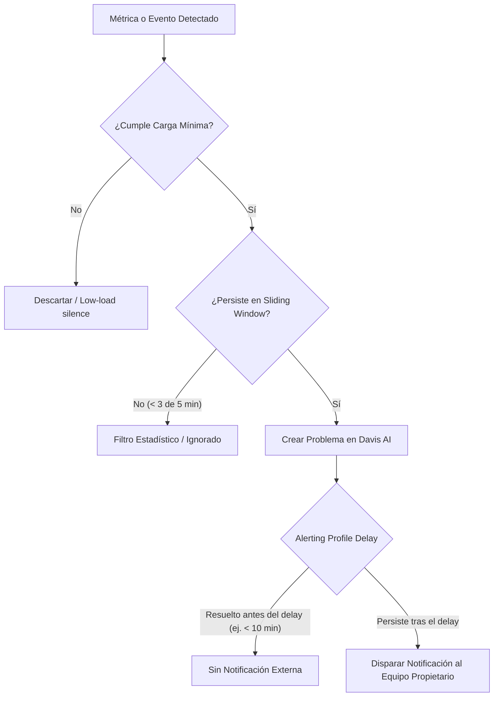

# Buenas Prácticas de Alertas y Detección de Anomalías por Defecto en Dynatrace

Esta skill proporciona las directrices operativas, arquitectónicas y de configuración recomendadas para gestionar el catálogo de alertas predeterminadas y personalizadas en Dynatrace. Su propósito es maximizar la precisión en la detección de incidentes reales mediante el motor **Davis AI**, eliminando el ruido operacional (*alert fatigue* o *overalerting*).

---

## 1. Fundamentos del Motor de Alertas: Davis AI vs Umbrales Estáticos

Dynatrace combina dos paradigmas complementarios para la detección de problemas: **detección adaptativa multidimensional (baselining automático)** y **umbrales fijos (estáticos)** ([Anomaly detection](https://docs.dynatrace.com/docs/dynatrace-intelligence/anomaly-detection)).

| Paradigma | Mecanismo | Cuándo Utilizarlo | Riesgo si se usa mal |
|---|---|---|---|
| **Auto-Adaptive Threshold (Davis AI)** | Calcula diariamente la línea base usando percentiles 99 y el rango intercuartil (IQR 25-75) de los últimos **7 días** de mediciones ([Auto-adaptive thresholds](https://docs.dynatrace.com/docs/dynatrace-intelligence/anomaly-detection/auto-adaptive-threshold)). | Métricas con patrones estacionales (día/noche, días laborales vs fin de semana) como tiempo de respuesta, carga o tráfico. | Alertas prematuras durante los primeros 7 días de aprendizaje si no se configuran filtros de carga mínima. |
| **Static Thresholds (Umbrales Fijos)** | Dispara eventos cuando una métrica cruza un valor absoluto predeterminado durante un número definido de muestras. | Métricas con límites físicos conocidos o SLAs contractuales (ej.: espacio en disco < 10%, disponibilidad de procesos críticos, error rate > 5% contractual). | Fatiga de alertas por picos transitorios normales o infra-alerting en valles de baja demanda. |

### Mecanismo de Ventana Deslizante (Sliding Window)
Para evitar alertas por fluctuaciones momentáneas aisladas, Dynatrace evalúa las violaciones mediante una ventana móvil:
- **Configuración por defecto:** `3 minutos violados dentro de una ventana de 5 minutos` (3/5).
- **Recomendación para entornos altamente volátiles:** Aumentar la ventana a `5 minutos violados en una ventana de 10 minutos` para filtrar micro-picos antes de abrir un evento de problema.

---

## 2. Buenas Prácticas en Servicios y Bases de Datos

En servicios de aplicación (backend) y bases de datos, las alertas por defecto cubren cuatro vectores clave ([Adjust sensitivity for services](https://docs.dynatrace.com/docs/dynatrace-intelligence/anomaly-detection/adjust-sensitivity-anomaly-detection/adjust-sensitivity-services), [Adjust sensitivity for databases](https://docs.dynatrace.com/docs/dynatrace-intelligence/anomaly-detection/adjust-sensitivity-anomaly-detection/adjust-sensitivity-services-database)):

### 2.1. Degradación de Tiempo de Respuesta (Response Time Degradation)
- **Evaluación dual:** Dynatrace evalúa tanto la mediana de **todas las respuestas** como el **10% más lento** (*slowest 10%*). Si cualquiera de los dos viola los umbrales absolutos y relativos simultáneamente, se dispara el evento.
- **Nivel de confianza estadística (Sensitivity):**
  - **High:** Sin margen estadístico adicional; alerta ante la primera desviación (usar solo en transacciones hiper-críticas).
  - **Medium (Recomendado):** Confianza estadística razonable para descartar variaciones típicas.
  - **Low:** Requiere alta significancia estadística; ideal para endpoints con alta dispersión natural.
- **Filtro de carga baja (*Low-load exclusion*):** **CRÍTICO.** Definir un umbral de `actions/min` o `requests/min` (ej.: < 10 req/min) por debajo del cual el servicio se considere en baja carga. Sin esto, una sola petición lenta en horario nocturno disparará un falso positivo.

### 2.2. Aumento en Tasa de Errores (Failure Rate Increase)
- **Regla de doble condición:** Requiere la violación tanto del incremento **relativo (%)** como del incremento **absoluto (%)** respecto a la línea base.
- **Tiempo mínimo en estado anómalo (*Abnormal state duration*):** Configurar al menos `3 a 5 minutos` sostenidos para evitar alertar por reinicios controlados de pods o microcortes de red transitorios.

### 2.3. Caídas y Picos de Carga (Load Drops & Load Spikes)
- Las caídas abruptas de carga suelen indicar fallas aguas arriba (ej.: balanceador de carga o frontend caído).
- **Buena práctica:** Activar *Detect service load drops* solo en servicios de entrada o APIs perimetrales; en microservicios internos profundos, las fluctuaciones de carga pueden ser legítimas y generar ruido innecesario.

---

## 3. Buenas Prácticas en Aplicaciones Web y Experiencia Digital (RUM)

Para aplicaciones frontend monitoreadas con Real User Monitoring ([Adjust sensitivity for applications](https://docs.dynatrace.com/docs/dynatrace-intelligence/anomaly-detection/adjust-sensitivity-anomaly-detection/adjust-sensitivity-applications)):

1. **Key Performance Metric Degradation:**
   - Monitorear métricas de Core Web Vitals (Largest Contentful Paint, First Input Delay, Cumulative Layout Shift) o tiempo de carga de página (*User Action Duration*).
   - Aplicar exclusión de tráfico bajo (*low-traffic threshold*) para evitar alertas cuando hay pocos usuarios concurrentes navegando.
2. **Traffic Drops & Spikes:**
   - Davis aprende el ciclo semanal (7 días). Configurar alertas de caída de tráfico con umbrales porcentuales razonables (ej.: caída > 50% vs histórico esperado para esa hora y día).
3. **Failure Rate en Frontend:**
   - Diferenciar errores JavaScript de errores de backend HTTP (4xx vs 5xx). Ignorar excepciones de terceros (scripts de analytics/marketing externos) ajustando las reglas de captura de errores RUM.

---

## 4. Buenas Prácticas en Infraestructura y Host Monitoring

### 4.1. Alertas de Disco: Migración a Disk Edge Alerting
> [!IMPORTANT]
> A partir de SaaS v1.308, las alertas de disco tradicionales del servidor están deshabilitadas por defecto para nuevos tenants. La práctica oficial recomendada es **Disk Edge Alerting** (requiere OneAgent v1.293+) ([Adjust sensitivity for infrastructure](https://docs.dynatrace.com/docs/dynatrace-intelligence/anomaly-detection/adjust-sensitivity-anomaly-detection/adjust-sensitivity-infastructure)).

- **Ventajas de Disk Edge Alerting:** Permite definir políticas específicas filtrando por:
  - Sistema operativo (Linux / Windows / AIX).
  - Patrón de nombre de disco o punto de montaje (ej.: ignorar `/boot` o discos de volumen efímero, enfocar en `/data` o `D:\Database`).
  - Métricas avanzadas: espacio disponible (%), inodes disponibles, tiempo de lectura/escritura y detección de sistema de archivos en solo lectura (*read-only file system*).
- **Reglas jerárquicas:**
  ```text
  Global Setting (Ambiente) ➔ Host Group Setting ➔ Host Setting / Custom Disk Detection Rule
  ```
  La regla más específica prevalece siempre sobre la más general.

### 4.2. Disponibilidad de Process Groups (Process Group Availability)
- Por defecto, la alerta de caída de procesos está desactivada para grupos de procesos genéricos ([Process group availability monitoring](https://docs.dynatrace.com/docs/observe/infrastructure-observability/process-groups/monitoring/process-group-availability-monitoring-and-alerting)).
- **Modos recomendados:**
  - **Mínimo de instancias activas (*Minimum running processes threshold*):** Ideal para clusters en alta disponibilidad (ej.: alertar solo si quedan menos de 2 procesos en ejecución de 4 previstos).
  - **Cualquier proceso no disponible:** Reservar exclusivamente para procesos singleton críticos (ej.: demonios de base de datos o colas de mensajería sin réplica).

---

## 5. Prevención de Ruido: Estrategias Anti-Overalerting

Para erradicar la fatiga de alertas (*overalerting*) en operaciones, implementar las siguientes directrices ([Best practices for avoiding overalerting](https://docs.dynatrace.com/docs/dynatrace-intelligence/use-cases/avoid-overalerting)):



### Reglas de Oro Anti-Overalerting:
1. **Escalonar Notificaciones en Alerting Profiles:**
   - **Disponibilidad (Availability):** Notificar de inmediato (0 minutos de retardo) a guardias de operaciones.
   - **Errores (Error):** Retardar la notificación externa **5 a 10 minutos**. La mayoría de los micro-picos de error se auto-recuperan antes de los 10 minutos.
   - **Rendimiento / Slowdowns:** Retardar la notificación **10 a 15 minutos**.
   - **Alertas personalizadas / Info:** Retardar **15 a 30 minutos**.
2. **Definir siempre Umbral de Baja Carga (*Low-load threshold*):**
   - Nunca dejar un servicio o base de datos evaluando tiempos de respuesta sin fijar una tasa mínima de peticiones por minuto.
3. **Mantenimientos y Despliegues Automatizados:**
   - Configurar **Maintenance Windows** durante ventanas de release o backups nocturnos para suprimir la generación de alertas y notificaciones.
4. **Agrupar Problemas con Davis AI Root Cause Analysis:**
   - No crear alertas individuales por cada host o pod que falle si pertenecen a un mismo clúster; permitir que Davis consolide la causa raíz en un solo problema con impacto de negocio.

---

## 6. Segmentación, Gobernanza y Anomaly Detection App

### 6.1. Uso de Segments en Detección de Anomalías
El uso de **Filter Segments** desacopla la lógica de las consultas DQL de los filtros de entorno ([Use segments with custom alerts](https://docs.dynatrace.com/docs/dynatrace-intelligence/use-cases/use-segments-anomaly-detection)):

- **Reusabilidad:** Definir segmentos como `environment = "production"` o `owner = "core-banking"` una sola vez y aplicarlos a múltiples detectores de anomalías.
- **Queries DQL limpias y costo-eficientes:** El DQL se enfoca únicamente en el cálculo de series temporales (`timeseries`, `makeTimeseries`) y agregaciones, mientras que el Segment inyecta automáticamente los filtros de alcance.
- **Reducción de falsos positivos:** Aísla el alcance exclusivamente a las entidades bajo responsabilidad del equipo correspondiente.

### 6.2. Gobernanza de Custom Alerts en Anomaly Detection App
La **Anomaly Detection App** proporciona visibilidad del estado de salud de todos los detectores ([Anomaly Detection app](https://docs.dynatrace.com/docs/dynatrace-intelligence/anomaly-detection/anomaly-detection-app), [Anomaly Detection status types](https://docs.dynatrace.com/docs/dynatrace-intelligence/anomaly-detection/anomaly-detection-app/anomaly-detection-status-types)):

- **Actores de Ejecución (*Custom Alert Actors*):**
  - Configurar las alertas para ejecutarse bajo **Service Users** dedicados en lugar de usuarios personales. Si un usuario abandona la organización, las alertas vinculadas a su cuenta personal fallarán o se desactivarán.
- **Monitoreo de Salud de Detectores:**
  - **Success rate > 99%:** Detector saludable.
  - **Success rate 95% - 99%:** Requiere revisión de rendimiento de la consulta.
  - **Success rate < 95% / Error:** Detector degradado o fallando.
- **Comportamiento de Throttling ante Fallas Continuas:**
  - Dynatrace cuenta con un mecanismo de seguridad: si una consulta DQL de alerta falla repetidamente, se suprime progresivamente el reintento (de cada 2 min a 4, 8, 16, 32, 64 min y finalmente 1 vez cada 24 horas) para evitar consumo indebido y retrasos en la cola.
  - **Límite de tiempo:** Las consultas DQL de Anomaly Detection tienen un límite de ejecución estricto de **10,000 ms (10 segundos)**.

### 6.3. Asignación de Propiedad (Entity Ownership)
- Asignar dueños (*Ownership Teams*) a todas las entidades críticas mediante etiquetas de Kubernetes (`dt.owner`), metadatos de host o variables de entorno ([Best practices for entity ownership](https://docs.dynatrace.com/docs/deliver/ownership/ownership-classic/best-practices)).
- Vincular los Alerting Profiles directamente a los equipos propietarios para garantizar que solo los responsables directos reciban las notificaciones.

---

## 7. Checklist de Auditoría de Alertas por Defecto

Al desplegar o auditar la configuración de alertas en un tenant Dynatrace, validar los siguientes puntos:

- [ ] **Low-load exclusion configurado:** Todos los servicios y bases de datos tienen umbrales de tráfico mínimo para evitar falsos positivos nocturnos.
- [ ] **Alerting Profiles con retraso escalonado:** Ningún canal de notificación externa (Slack, Teams, PagerDuty, Jira) recibe eventos de performance o error con retardo de 0 minutos (excepto Availability crítica).
- [ ] **Discos migrados a Disk Edge Alerting:** Se utilizan reglas filtradas por nombre de disco, sistema operativo o tags, excluyendo discos temporales o de boot estáticos.
- [ ] **Maintenance Windows activas:** Existen ventanas de mantenimiento programadas para ventanas de despliegue, parches o reinicios programados.
- [ ] **Actores de ejecución desacoplados:** Los custom alerts corren bajo cuentas de servicio institucionales (`Service Users`), no usuarios individuales.
- [ ] **Consultas DQL optimizadas:** Todas las alertas personalizadas en Grail utilizan `timeseries`/`makeTimeseries`, ejecutan en < 10 segundos y filtran por `Segments`.
