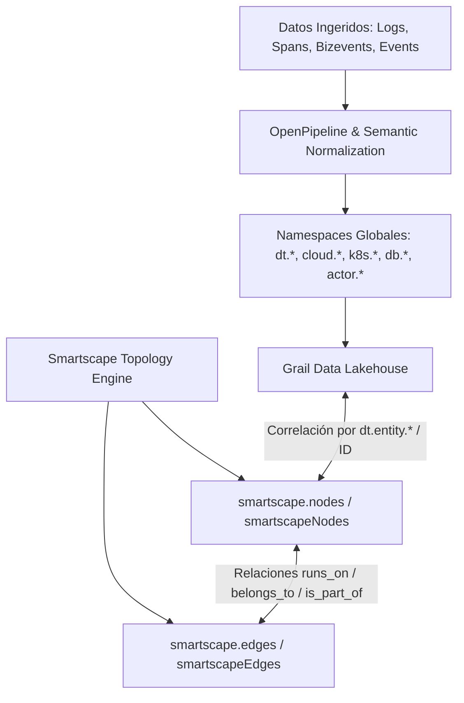

# Diccionario Semántico y Modelo de Topología Smartscape en Dynatrace

El **Dynatrace Semantic Dictionary** y el **Modelo de Topología Smartscape en Grail** constituyen la taxonomía universal de observabilidad y seguridad para toda la plataforma Dynatrace. Estandarizan los nombres de atributos, tipos de datos, unidades y relaciones entre entidades físicas, virtuales, serverless, cloud y de negocio.

---

## 1. Fundamentos del Diccionario Semántico y Modelo Grail

El Semantic Dictionary define un lenguaje común para logs, métricas, eventos, trazas (spans), bizevents y nodos de infraestructura/topología almacenados en Grail.



### Principios Fundamentales
1. **Consistencia de Nomenclatura:** Los atributos usan notación snake_case jerárquica con prefijos de namespace (`k8s.pod.name`, `dt.security_context`, `aws.arn`, `db.database.name`).
2. **Tipado Estricto:** Tipos nativos soportados: `timestamp` (nanosegundos UNIX Epoch), `duration`, `string`, `smartscapeId`, `record`, `record[]`, `string[]`.
3. **Identificadores Smartscape de Nueva Generación:** Un Smartscape ID se estructura como `<UPPER_CASE_ENTITY_TYPE>-<16_HEX_CHARS>` (ejemplo: `HOST-C251A1173C2B4B39`, `AZURE_MICROSOFT_COMPUTE_VIRTUALMACHINES-017198AD253CBD63`), reemplazando el formato `id_classic`.

---

## 2. Referencia Global de Campos y Namespaces Semánticos

Referencia oficial: [Global field reference — Dynatrace Docs](https://docs.dynatrace.com/docs/semantic-dictionary/fields)

### 2.1. Campos Base (Top-Level Base Fields)
Comunes a todos los registros de telemetría (logs, spans, eventos):

| Atributo | Tipo | Estado | Descripción | Ejemplo |
|---|---|---|---|---|
| `timestamp` | `timestamp` | stable | Momento de origen en nanosegundos UNIX Epoch. Si no está presente, se asigna en ingesta. | `1649822520123123123` |
| `start_time` | `timestamp` | stable | Timestamp de inicio del intervalo o punto de datos ($\le \text{end\_time}$). | `1649822520123123123` |
| `end_time` | `timestamp` | stable | Timestamp de fin del intervalo o medición ($\ge \text{start\_time}$). | `1649822520123123165` |
| `duration` | `duration` | stable | Diferencia en nanosegundos entre `start_time` y `end_time`. | `42000000` (42 ms) |
| `timeframe` | `record[]` | stable | Ventana de tiempo representada por un registro de serie temporal. | `{ start: ..., end: ... }` |
| `interval` | `string` | stable | Frecuencia de muestreo en series temporales. | `1 min`, `5 min` |

### 2.2. Namespaces Semánticos Core

| Namespace | Propósito | Campos Clave Destacados |
|---|---|---|
| `dt.system.*` | Metadatos internos de plataforma y almacenamiento Grail | `dt.system.bucket`, `dt.system.storage_class` |
| `dt.security_context` | Contextos de aislamiento y políticas de control de acceso ABAC | `dt.security_context` (array de strings: `["prod", "finance"]`) |
| `dt.cost.*` | Atribución de consumo DPS y centros de costos | `dt.cost.costcenter`, `dt.cost.product` |
| `dt.entity.*` | Identificadores de entidades vinculadas | `dt.entity.host`, `dt.entity.process_group_instance`, `dt.entity.service` |
| `actor.*` | Origen de amenazas o actividad de seguridad detectada | `actor.geo.city.name`, `actor.geo.continent.name`, `actor.ip` |
| `authentication.*` | Autenticación y credenciales de acceso | `authentication.type`, `authentication.grant.type`, `authentication.client.id` (prefijo `dt0s02.`), `authentication.token` |
| `availability.*` | Estado y porcentaje de disponibilidad de componentes | `availability.state` (`AVAILABLE`, `UNAVAILABLE`, `DEGRADED`) |
| `app.*` | Metadatos de la aplicación de usuario o carga de trabajo | `app.name`, `app.version`, `app.status.health.status` |
| `captured_attribute.*` | Parámetros y valores en crudo capturados por OneAgent (Request Attributes) | `captured_attribute.<rule_name>` |
| `cloud.*` | Proveedores y recursos de nube pública/privada | `cloud.provider` (`azure`, `aws`, `gcp`, `alibaba`), `cloud.region`, `cloud.zone` |
| `db.*` | Motores y llamadas de bases de datos | `db.system` (`mssql`, `oracle`, `postgresql`, `mysql`), `db.database.name`, `db.instance.name`, `db.connection_details` |

---

## 3. Estructura de Entidades Smartscape (`smartscape.nodes`)

Todos los nodos del grafo Smartscape en Grail implementan los siguientes atributos estándar:

Referencia oficial: [Classic topology — Dynatrace Docs](https://docs.dynatrace.com/docs/semantic-dictionary/model/dt-entities)

| Campo | Tipo | Definición y Uso |
|---|---|---|
| `id` | `smartscapeId` | Identificador canónico `<TYPE>-<HEX16>`. Clave primaria para uniones y relaciones. |
| `id_classic` | `string` | *(Deprecated)* ID del almacén clásico (ej. `HOST-4B2E...`). Presente solo para compatibilidad histórica. |
| `name` | `string` | Nombre legible de la entidad (`localhost`, `easyTravel-prod`, `k8s-worker-01`). |
| `type` | `string` | Tipo de entidad en `UPPER_SNAKE_CASE` (ej. `HOST`, `PROCESS_GROUP_INSTANCE`, `AZURE_VM`). |
| `lifetime` | `timeframe` | Registro `{ start: timestamp, end: timestamp }`. Marca cuándo fue observada la entidad por primera y última vez. |
| `tags` | `record` | Mapa consolidado de etiquetas por contexto. Accesible como `tags[clave]` o `tags:contexto[clave]`. |
| `references` | `record` | Aristas estáticas hacia otras entidades. Ejemplo: `references[runs_on.host] = ["HOST-0E9038C7C4409D69"]`. *(Oculto por defecto; se proyecta con `fieldsAdd`)*. |
| `dt.security_context` | `string[]` | Segmentos de seguridad asignados para filtrado en ABAC / OpenPipeline. |

---

## 4. Consultas DQL de Topología con `smartscapeNodes` y `smartscapeEdges`

En Grail se utilizan los comandos específicos de topología para navegar el grafo:

### 4.1. Filtrado de Nodos por Tipo (`smartscapeNodes`)

```dql
// Obtener todas las instancias de Host monitoreadas
smartscapeNodes "HOST"
| fields id, name, type, lifetime, dt.security_context
```

```dql
// Descubrir recursos cloud de Azure por prefijo wildcard
smartscapeNodes "AZURE_MICROSOFT_COMPUTE*"
| summarize total_vms = count(), by: { name, type }
```

```dql
// Inspección de bases de datos SQL Server
smartscapeNodes DB_INSTANCE_MSSQL
| summarize count(), by: { db.instance.version }
```

### 4.2. Navegación de Aristas y Relaciones (`smartscapeEdges`)

```dql
// Relación runs_on: Bases de datos y sus réplicas de disponibilidad Always On
smartscapeEdges "runs_on"
| filter matchesValue(source_type, "DB_AVAILABILITY_DATABASE_MSSQL") and matchesValue(target_type, "DB_AVAILABILITY_REPLICA_MSSQL")
| fields database_name = getNodeName(source_id), replica_name = getNodeName(target_id)
```

```dql
// Relación is_part_of: Réplicas que pertenecen a un Availability Group
smartscapeEdges "is_part_of"
| filter matchesValue(source_type, "DB_AVAILABILITY_REPLICA_MSSQL") and matchesValue(target_type, "DB_AVAILABILITY_GROUP_MSSQL")
| fields replica_name = getNodeName(source_id), group_name = getNodeName(target_id)
```

```dql
// Relación belongs_to: Grupos de discos ASM y sus clústeres / instancias Oracle
smartscapeEdges "belongs_to"
| filter matchesValue(source_type, "DB_ASM_DISK_GROUP_ORACLE") and (matchesValue(target_type, "DB_CLUSTER_ORACLE") or matchesValue(target_type, "DB_INSTANCE_ORACLE"))
| fields disk_group_name = getNodeName(source_id), parent_name = getNodeName(target_id), target_type
```

---

## 5. Catálogo de Tipos y Representantes Multicloud

### 5.1. Microsoft Azure

Referencias oficiales:
- [Hybrid & Multicloud](https://docs.dynatrace.com/docs/semantic-dictionary/model/smartscape/azure/hybrid)
- [Networking](https://docs.dynatrace.com/docs/semantic-dictionary/model/smartscape/azure/networking)
- [Compute](https://docs.dynatrace.com/docs/semantic-dictionary/model/smartscape/azure/compute)
- [Databases](https://docs.dynatrace.com/docs/semantic-dictionary/model/smartscape/azure/databases)
- [Containers](https://docs.dynatrace.com/docs/semantic-dictionary/model/smartscape/azure/containers)

| Tipo de Nodo Smartscape | Recurso Azure Representado | Campo de Nombre (`name`) | ID Input (Cálculo del ID) |
|---|---|---|---|
| `AZURE_MICROSOFT_COMPUTE_VIRTUALMACHINES` | Virtual Machine | `azure.resource.name` | `azure.resource.id` |
| `AZURE_MICROSOFT_CONTAINERSERVICE_MANAGEDCLUSTERS` | Azure Kubernetes Service (AKS) | `azure.resource.name` | `azure.resource.id` |
| `AZURE_MICROSOFT_SQL_SERVERS_DATABASES` | Azure SQL Database | `azure.resource.name` | `azure.resource.id` |
| `AZURE_MICROSOFT_NETWORK_APPLICATIONGATEWAYS` | Application Gateway | `azure.resource.name` | `azure.resource.id` |
| `AZURE_MICROSOFT_STORAGE_STORAGEACCOUNTS` | Storage Account | `azure.resource.name` | `azure.resource.id` |
| `AZURE_MICROSOFT_APPCONFIGURATION_CONFIGURATIONSTORES` | App Configuration Store | `azure.resource.name` | `azure.resource.id` |

### 5.2. Amazon Web Services (AWS)

Referencias oficiales:
- [Amazon EC2](https://docs.dynatrace.com/docs/semantic-dictionary/model/smartscape/aws/ec2)
- [Amazon Relational Database Service](https://docs.dynatrace.com/docs/semantic-dictionary/model/smartscape/aws/rds)

| Tipo de Nodo Smartscape | Recurso AWS Representado | Campo de Nombre (`name`) | ID Input (Cálculo del ID) |
|---|---|---|---|
| `AWS_EC2_INSTANCE` | Instancia EC2 | `aws.resource.name` | `aws.arn` |
| `AWS_RDS_DBCLUSTER` | RDS Aurora / DocumentDB Cluster | `aws.resource.name` | `aws.arn` |
| `AWS_RDS_DBINSTANCE` | RDS Database Instance | `aws.resource.name` | `aws.arn` |
| `AWS_RDS_DBCLUSTERSNAPSHOT` | RDS Cluster Snapshot | `aws.resource.name` | `aws.arn` |
| `AWS_RDS_DBSUBNETGROUP` | Subnet Group RDS | `aws.resource.name` | `aws.arn` |

### 5.3. Google Cloud Platform (GCP)

Referencias oficiales:
- [Google Compute Engine](https://docs.dynatrace.com/docs/semantic-dictionary/model/smartscape/gcp/compute)
- [Vertex AI](https://docs.dynatrace.com/docs/semantic-dictionary/model/smartscape/gcp/aiplatform)
- [Network Services](https://docs.dynatrace.com/docs/semantic-dictionary/model/smartscape/gcp/networkservices)
- [Dataplex](https://docs.dynatrace.com/docs/semantic-dictionary/model/smartscape/gcp/dataplex)
- [Dataproc](https://docs.dynatrace.com/docs/semantic-dictionary/model/smartscape/gcp/dataproc)
- [NetApp Volumes](https://docs.dynatrace.com/docs/semantic-dictionary/model/smartscape/gcp/netapp)
- [Backup & DR](https://docs.dynatrace.com/docs/semantic-dictionary/model/smartscape/gcp/backupdr)
- [VM Migration](https://docs.dynatrace.com/docs/semantic-dictionary/model/smartscape/gcp/vmmigration)

| Tipo de Nodo Smartscape | Recurso GCP Representado | Campo de Nombre (`name`) |
|---|---|---|
| `GCP_COMPUTE_GOOGLEAPIS_COM_INSTANCE` | Compute Engine VM | `gcp.resource.name` |
| `GCP_DATAPLEX_GOOGLEAPIS_COM_LAKE` | Dataplex Data Lake | `gcp.resource.name` |
| `GCP_DATAPROC_GOOGLEAPIS_COM_CLUSTER` | Dataproc Hadoop/Spark Cluster | `gcp.resource.name` |
| `GCP_NETWORKSERVICES_GOOGLEAPIS_COM_HTTPROUTE` | Network Services HTTP Route | `gcp.resource.name` |
| `GCP_NETAPP_GOOGLEAPIS_COM_VOLUME` | NetApp Cloud Volume | `gcp.resource.name` |
| `GCP_BACKUPDR_GOOGLEAPIS_COM_BACKUP` | Backup and DR Backup | `gcp.resource.name` |
| `GCP_VMMIGRATION_GOOGLEAPIS_COM_MIGRATINGVM` | VM Migration Active Workload | `gcp.resource.name` |

### 5.4. Bases de Datos On-Premise y Gestionadas

Referencias oficiales:
- [SQL Server](https://docs.dynatrace.com/docs/semantic-dictionary/model/smartscape/db/mssql)
- [Oracle Database](https://docs.dynatrace.com/docs/semantic-dictionary/model/smartscape/db/oracle)

| Tipo de Nodo Smartscape | Descripción | Atributos Específicos |
|---|---|---|
| `DB_INSTANCE_MSSQL` | Instancia de Microsoft SQL Server | `db.instance.version`, `db.connection_details.hostname`, `db.connection_details.port` |
| `DB_DATABASE_MSSQL` | Base de datos individual SQL Server | `db.database.name` |
| `DB_AVAILABILITY_GROUP_MSSQL` | Grupo de disponibilidad Always On | `availability_group_id` |
| `DB_AVAILABILITY_REPLICA_MSSQL` | Réplica de disponibilidad Always On | `availability_replica_id` |
| `DB_INSTANCE_ORACLE` | Instancia Oracle DB | `db.instance.version`, `db.connection_details` |
| `DB_DATABASE_ORACLE` | Base de datos Oracle (RAC o Standalone) | `db.database.name` |
| `DB_CLUSTER_ORACLE` | Clúster Oracle RAC | `db.connection_details` |
| `DB_ASM_DISK_GROUP_ORACLE` | Grupo de almacenamiento ASM | `group_name`, `db.connection_details` |

---

## 6. Mapeo de Tipos Clásicos a Semántica de Grail

| Entidad Clásica (Classic Model) | Tipo Smartscape Grail | Campo en Logs/Spans Grail |
|---|---|---|
| `HOST` | `HOST` | `dt.entity.host` |
| `PROCESS_GROUP` | `PROCESS_GROUP` | `dt.entity.process_group` |
| `PROCESS_GROUP_INSTANCE` | `PROCESS_GROUP_INSTANCE` | `dt.entity.process_group_instance` |
| `SERVICE` | `SERVICE` | `dt.entity.service` |
| `APPLICATION` | `APPLICATION` | `dt.entity.application` |
| `KUBERNETES_CLUSTER` | `KUBERNETES_CLUSTER` | `k8s.cluster.name` / `dt.entity.kubernetes_cluster` |
| `KUBERNETES_NODE` | `KUBERNETES_NODE` | `k8s.node.name` / `dt.entity.kubernetes_node` |
| `KUBERNETES_WORKLOAD` | `KUBERNETES_WORKLOAD` | `k8s.workload.name` / `dt.entity.kubernetes_workload` |

---

## 7. Buenas Prácticas y Patrones de Enriquecimiento

1. **Correlación de Logs con Entidades:**
   Al escribir procesadores en OpenPipeline o consultar logs en Grail, siempre mapear los identificadores hacia los atributos canónicos `dt.entity.*` para habilitar el filtrado unificado en dashboards y Davis AI.
   ```dql
   fetch logs
   | filter isNotNull(dt.entity.host)
   | summarize error_count = countIf(loglevel == "ERROR"), by: { dt.entity.host }
   | lookup [ smartscapeNodes "HOST" | fields id, host_name = name ], sourceField: dt.entity.host, lookupField: id
   ```

2. **Aislamiento Multitenant con `dt.security_context`:**
   En entornos compartidos, todas las entidades y registros de telemetría deben heredar el contexto de seguridad asignado al procesar las fuentes de ingesta para garantizar el cumplimiento de políticas IAM/ABAC.

3. **Optimización de Consultas Topológicas:**
   - Usar `matchesValue(source_type, "...")` y `matchesValue(target_type, "...")` al consultar `smartscapeEdges` para evitar escaneos de aristas no relacionadas.
   - Proyectar únicamente los campos necesarios con `fields` o `fieldsAdd`.
