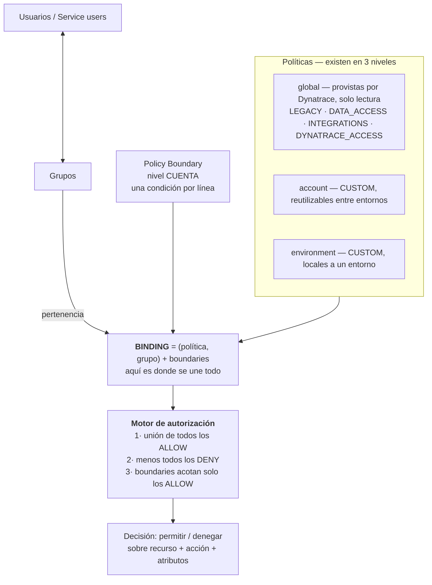

# Control de acceso ABAC en Dynatrace

Dynatrace no tiene roles con permisos fijos: tiene **atributos evaluados en tiempo de petición**.
Eso es más potente y más fácil de arruinar. Casi todos los errores de permisos que vas a encontrar
salen de tres malentendidos: creer que el boundary vive en la política, creer que quitar un ALLOW
alcanza para revocar, y no verificar con un usuario real.

Esta skill trae el modelo correcto, la referencia completa de atributos, los patrones probados en
producción y las trampas que ya costaron caro.

## El modelo



### Las tres correcciones al modelo intuitivo

**1. El boundary se ata al BINDING, no a la política.**

Es el punto que más se malinterpreta y el que hace posible el multicliente. La API lo deja claro:

```
POST /iam/v1/repo/{level}/{id}/bindings/{policyUuid}/{groupUuid}
     { "boundaries": ["<boundaryUuid>"] }
```

El boundary vive en la tupla *(política, grupo)*. **Una misma política atada a 6 grupos puede llevar
6 boundaries distintos.** Por eso no necesitás 6 políticas para 6 clientes: necesitás **una política
y 6 boundaries**. Si lo dibujás como "boundary → política" vas a terminar duplicando políticas sin
razón.

**2. Quitar un ALLOW no revoca nada si otra política lo otorga.**

El efectivo es la **unión de todos los ALLOW** de todas las políticas atadas al grupo, **menos todos
los DENY**. Si `Standard User` otorga `app-engine:apps:run` sin condición, tu política restringida no
lo recorta: hay que **desatar** `Standard User` del grupo o denegarlo explícitamente.

Corolario: **un ALLOW condicionado no puede recortar un ALLOW incondicional de otra política.** Solo
un DENY lo hace.

**3. Los boundaries no aplican a los DENY.**

Un `DENY` es absoluto para el grupo, sin importar el boundary. Es buena noticia: tus DENY siguen
valiendo aunque el boundary esté mal puesto. Es la capa que no depende de nadie.

### RBAC y ABAC conviven

El RBAC clásico no es una rama paralela: es un **permiso ABAC más**. `environment:roles:viewer`,
`environment:roles:manage-settings`, etc. son permisos que se otorgan igual que cualquier otro, y son
el puente hacia el comportamiento de Dynatrace Classic (dominio `.live`).

Consecuencia práctica: **para cortar el acceso a Classic hay que quitar los `environment:roles:*`**,
no basta con denegar las apps `dynatrace.classic.*`.

## Diseño: el orden correcto

Diseñar de menos a más nunca funciona en Dynatrace, porque las políticas por defecto ya otorgan
mucho. El orden que sí funciona:

1. **Inventariá lo que el grupo ya tiene.** Listá los bindings y leé el `statementQuery` **completo**
   de cada política atada. No te fíes del nombre.
2. **Identificá de dónde viene cada permiso que sobra.** Casi siempre de una política global.
3. **Decidí entre recortar o reemplazar.** Si la política global otorga algo incondicional que
   necesitás condicionar, **reemplazala** por una copia propia recortada. Si solo sobra, **DENY**.
4. **Escribí allow-list, no deny-list.** Ver [patrones](references/patrones.md).
5. **Boundary para el alcance de datos**, no para el alcance de funciones.
6. **Verificá con usuario real.**

### Allow-list contra deny-list

La diferencia decide si tu diseño sobrevive a los upgrades de Dynatrace.

| | Deny-list | Allow-list |
|---|---|---|
| Forma | `DENY ... WHERE app-id = "X"` × N | `ALLOW ... WHERE app-id IN (...)` |
| App nueva de un upgrade | **Queda visible** | Queda denegada |
| Mantenimiento | N líneas, crece siempre | Una lista corta |
| Requisito | ninguno | **desatar la política que otorga incondicional** |

Siempre allow-list. El costo es tener que reemplazar la política por defecto; la ganancia es que no
tenés que auditar cada release de Dynatrace.

## Las trampas

Cada una costó tiempo real. Detalle y evidencia en [`references/trampas.md`](references/trampas.md).

| # | Trampa |
|---|---|
| 1 | `Standard User` otorga `document:documents:write` y `:delete` → **los dashboards Gen3 son documentos**, no settings. Denegar `settings:objects:write` no impide crear ni borrar tableros |
| 2 | `All Grail data read access` otorga `storage:system:read` → **el audit log del tenant**, con secretos en claro y configuración de otros clientes |
| 3 | Un `DENY` sin condición mata un `ALLOW` condicionado de otra política. Ej.: `DENY settings:objects:write` anula el ALLOW de preferencias de usuario y nadie puede cambiar el tema |
| 4 | **Un `DENY` condicional sobre tablas de Grail se ejecuta incondicionalmente.** `DENY storage:logs:read WHERE x` mata logs por completo |
| 5 | **Dos boundaries en un mismo binding** operan independientes; los permisos que ninguno cubra pueden quedar **sin restricción**. Varias condiciones van como líneas del mismo boundary |
| 6 | El servicio `document:` **no tiene atributos condicionales**. Sus 14 permisos son todo-o-nada |
| 7 | Las políticas IAM **no tienen `modificationInfo`**. No hay autor ni fecha. El único historial es el audit log y tu control de versiones |

## Verificación — no es opcional

**Ninguna configuración de permisos se da por cerrada sin ejecutarla como el usuario final.** La
inspección de políticas dice lo que debería pasar; solo la sesión real dice lo que pasa.

```
# 1. Aislamiento del audit log — esperado: 0 records
fetch dt.system.events, from: now()-2h | filter event.kind == "AUDIT_EVENT" | limit 10

# 2. Alcance de datos — esperado: solo el contexto propio
fetch bizevents, from: now()-30m | summarize count(), by:{dt.security_context}

# 3. Que sí vea lo suyo
fetch bizevents, from: now()-30m | filter dt.security_context == "<cliente>" | summarize count()
```

**`0 records` no es lo mismo que un error de permisos.** Si la consulta corre y devuelve vacío, el
permiso está concedido y el **boundary filtró** — que es el comportamiento correcto. Un error de
permisos se ve distinto.

### Semántica del boundary — verificada en producción

No está documentada por Dynatrace. Es *deny-by-default*:

| Registro | ¿Lo ve el grupo? |
|---|---|
| Contexto igual al del boundary | Sí |
| Contexto distinto | No |
| **Campo nulo / ausente** | **No** |

Un boundary sobre `dt.security_context` **sí** protege contra registros sin contexto. El riesgo del
dato sin clasificar no es de fuga, es de costo: nadie lo consume y se paga igual.

## Operación

Endpoints, scopes y plantillas en [`references/api.md`](references/api.md). Lo que no se salta:

- **Respaldá el `statementQuery` antes de cada `PUT`.** Es reemplazo, no merge.
- **Un `POST` por par (política, grupo).** `PUT /bindings/{policyUuid}` **no existe** (405). Operar
  por par evita reescribir los bindings del entorno entero.
- **Los boundaries viven a nivel CUENTA.** En `environment/{env}/boundaries` da *"Cannot get
  requested resource"*.
- **Cambios en horario de bajo impacto** cuando el grupo es de un cliente externo, y con el comando
  de reversión escrito **antes** de aplicar.

## Referencias

| Archivo | Contenido |
|---|---|
| [`references/modelo-y-atributos.md`](references/modelo-y-atributos.md) | Sintaxis de statements, operadores, y la referencia completa de atributos condicionales por namespace |
| [`references/api.md`](references/api.md) | Endpoints, scopes, plantillas y reversión |
| [`references/patrones.md`](references/patrones.md) | Patrones probados: allow-list de apps, aislamiento multicliente, cliente de solo consulta |
| [`references/trampas.md`](references/trampas.md) | Las 7 trampas con evidencia y corrección |
| [`references/replicacion.md`](references/replicacion.md) | Playbook para montar el esquema en un cliente nuevo |
