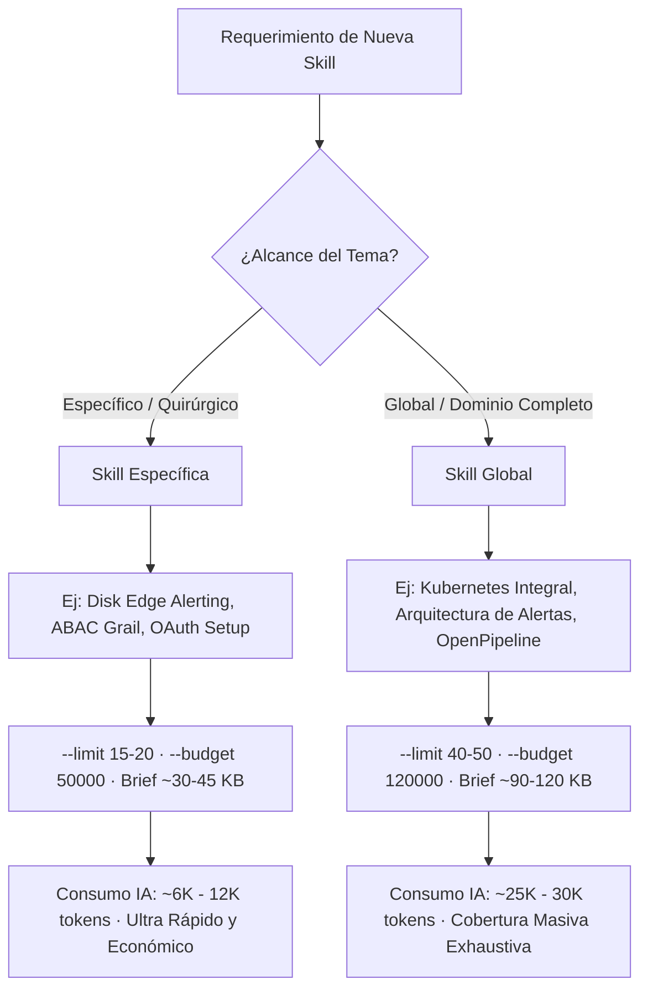

# Generador Semiautomático de Skills Validadas por Documentación

Esta meta-skill es el **único punto de entrada** para generar skills en `skills/<nombre>/` y `.agents/skills/`. Divide el trabajo para optimizar costo, profundidad y calidad:

| Actor | Responsabilidad | Límites Actualizados | Costo |
|---|---|---|---|
| **CLI (`dtx`)** | Lee hasta **40-50 docs completos** de la KB local, filtra ruido, destila código (hasta 3500 chars/bloque), outlines y contexto en `references/research-brief.md` | Presupuesto por defecto: **~120 KB** (~30K tokens) | **0 tokens IA** |
| **IA** | Lee **únicamente** el research-brief destilado y sintetiza el `SKILL.md` final | De ~6K tokens (específica) a ~30K tokens (global) | Bajo y acotado |
| **CLI (`validate`)** | Audita trazabilidad + calidad (mínimo 12 fuentes para HIGH, secciones H2, tamaño) | Determinista | **0 tokens IA** |

---

## 1. Estrategia de Diseño: Skills Específicas vs Skills Globales

Con los nuevos límites ampliados, es fundamental definir el alcance de la skill antes de ejecutar el draft:



### 1.1. Skills Específicas / Quirúrgicas (Enfoque Recomendado por Defecto)
* **Objetivo:** Resolver un problema técnico concreto o procedimiento especializado (ej. *Disk Edge Alerting*, *Políticas ABAC de Storage Grail*, *Setup de Tokens OAuth*).
* **Parámetros sugeridos:** `--limit 15` a `20` · `--budget 50000`.
* **Comportamiento:** El brief se mantiene compacto (~30-45 KB), capturando únicamente el código y contexto esencial con costo de tokens mínimo (~6K-12K tokens).

### 1.2. Skills Globales / Temas Amplios
* **Objetivo:** Documentar un subsistema completo o arquitectura integral (ej. *Monitoreo Integral de Kubernetes*, *Gobernanza y Catálogo Completo de Alertas*).
* **Parámetros sugeridos:** `--limit 40` a `50` · `--budget 120000`.
* **Comportamiento:** El CLI absorbe hasta 50 documentos oficiales completos y genera un brief exhaustivo (~90-120 KB ≈ 25K-30K tokens), permitiendo a la IA redactar manuales de ingeniería profundos y completos.

---

## 2. Parámetros y Opciones del CLI (`dtx skill draft`)

El comando `dtx skill draft` permite calibrar el volumen de destilación según el caso:

| Parámetro | Valor por Defecto | Uso para Skill Específica | Uso para Skill Global | Descripción |
|---|---|---|---|---|
| `--domain <dom>` | `auto` | Obligatorio (ej.: `grail`, `iam`) | Obligatorio (ej.: `kubernetes`, `general`) | Dominio temático dentro de la KB local. |
| `--limit <n>` | `40` docs | `15` a `20` | `40` a `50` | Máximo de páginas oficiales a procesar y extraer. |
| `--budget <bytes>` | `120000` (120 KB) | `50000` (50 KB) | `120000` a `150000` (120-150 KB) | Límite máximo de tamaño para `research-brief.md`. |
| `--max-code-chars <n>` | `3500` chars | `2000` | `4000` a `5000` | Caracteres máximos por bloque de código antes de truncar. |
| `--name <nombre>` | `auto` | Explícito (ej.: `dynatrace-disk-edge-alerts`) | Explícito (ej.: `dynatrace-alertas-best-practices`) | Nombre de la carpeta de la skill. |

---

## 3. Flujo Operativo en Tres Pasos

### Paso 1 — Draft Determinista (CLI)

```powershell
# Ejemplo para skill específica:
.\dtx.cmd skill draft "<caso específico>" --domain <dominio> --limit 20 --budget 50000 --name <nombre>

# Ejemplo para skill global / omnicomprensiva:
.\dtx.cmd skill draft "<tema amplio>" --domain <dominio> --limit 45 --budget 120000 --name <nombre>
```

### Paso 2 — Síntesis por IA

1. Leer **únicamente** `skills/<nombre>/references/research-brief.md` (NUNCA los documentos crudos de `docs/`).
2. Sintetizar `SKILL.md` con:
   - **Frontmatter YAML:** `name:` + `description:` rica con triggers detallados ("Úsala cuando pidan...").
   - **Secciones H2:** Estructuradas por casos de uso y temas reales destilados en el brief.
   - **Trazabilidad estricta:** Comandos, conceptos y fragmentos referenciados con enlaces oficiales `(https://docs.dynatrace.com/...)`.
   - **Bloques de código:** Incluir verbatim los bloques de código y configuraciones validadas presentes en el brief.
   - **Material extenso:** Si hay esquemas masivos o mapas de tokens, desacoplarlos en `references/*.md` para carga progresiva.
3. **Objetivo de tamaño:** `SKILL.md` denso ≥ 6 KB (y hasta 15-20 KB para skills globales).

### Paso 3 — Validación y Cierre (CLI)

```powershell
# 1. Validar trazabilidad y calidad
.\dtx.cmd skill validate <nombre>

# 2. Desplegar en el directorio de agentes (copiando el contenido para evitar anidación)
if (-not (Test-Path ".agents\skills\<nombre>")) { New-Item -ItemType Directory -Path ".agents\skills\<nombre>" }
Copy-Item -Recurse -Force "skills\<nombre>\*" ".agents\skills\<nombre>\"
```

---

## 4. Reglas de Validación y Criterios de Calidad

El validador (`dtx skill validate <nombre>`) audita los siguientes umbrales:

* **Calidad HIGH:**
  - $\ge 12$ fuentes documentales oficiales indexadas en `evidence.json`.
  - $\ge 4$ secciones H2 temáticas reales.
  - $\ge 4$ KB de contenido markdown denso.
* **Calidad MEDIUM:**
  - $\ge 6$ fuentes oficiales indexadas.
  - $\ge 4$ secciones H2 temáticas.
* **Avisos de Calidad LOW:**
  - Menos de 6 fuentes o contenido menor a 4 KB. En este caso se debe repetir el Paso 1 ajustando `--limit` o usando un prompt más específico.

---

## 5. Estructura Obligatoria de Archivos

```text
skills/<nombre-skill>/
├── SKILL.md                        # Requerido: síntesis de la IA desde el brief
├── references/
│   ├── research-brief.md           # Requerido: metadatos/destilación del CLI (tope ~120 KB)
│   ├── evidence.json               # Requerido: trazabilidad de fuentes oficiales
│   └── *.md                        # Opcional: tablas/esquemas para carga progresiva
├── scripts/                        # Opcional: scripts de soporte
└── examples/                       # Opcional: DQLs, JSONs, dashboards
```
